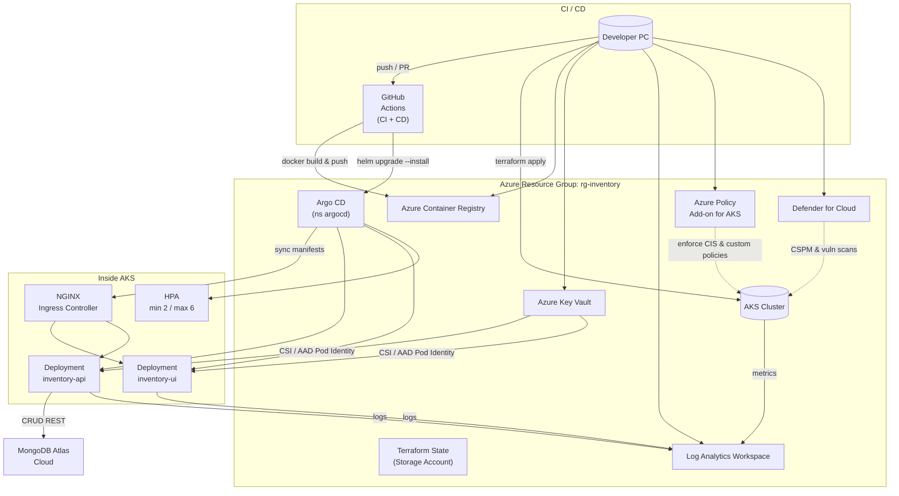

## 3️⃣ `InventoryAppTrial1` (+ Web‑UI)
[](http://localhost:4000/health)  
[](https://github.com/mcapostol/InventoryAppTrial1/actions/workflows/build-api.yml)  
[](https://github.com/mcapostol/InventoryAppTrial1/actions/workflows/build-ui.yml)  
[]  
[](https://github.com/mcapostol/InventoryAppTrial1/actions/workflows/codeql-analysis.yml) 
[](https://github.com/mcapostol/InventoryAppTrial1/security/dependabot)  

Internal tool for stock tracking across multiple warehouses. Written in Node & Express, plus a lightweight React Admin UI. This repo will evolve into a fully containerised micro‑service deployed on **AKS**.  

| Section   | Details                                                               |
|-----------|-----------------------------------------------------------------------|
| **Goal**  | CRUD inventory, QR‑scan intake, basic reporting (download to Excel/PDF). |
| **Stack** | Node.js 20, Express, MongoDB Atlas, React 18 (Vite), Jest, Docker, Helm. |
| **Status**| Proof‑of‑Concept (API + basic UI)                                      |

## Roadmap 🗺
- [x] REST API (items, locations, movements)  
- [x] React UI (table + forms)  
- [x] Dockerfile & Compose for local dev  
- [x] GitHub Actions → build & push image to ACR  
- [ ] Terraform module (AKS + Mongo DB flex server)  
- [ ] GitOps (ArgoCD) rollout Dev → Prod  
- [ ] Prometheus metrics + Grafana dashboard  
- [ ] Role‑based access (JWT + Entra ID)  

## Local dev
```bash
git clone https://github.com/mcapostol/InventoryAppTrial1  
cd InventoryAppTrial1  
npm ci               # backend  
npm run dev          # API on :4000  
cd web && npm ci && npm run dev   # UI on :5173
```

**Local Docker**
```bash
docker compose up --build
```

**Infrastructure Diagram**

