---

## 3️⃣ `InventoryAppTrial1` (+ Web‑UI)

```markdown
# Inventory App v1

Internal tool for stock tracking across multiple warehouses. Written in Node & Express, plus a lightweight React Admin UI. This repo will evolve into a fully containerised micro‑service deployed on **AKS**.

| Section | Details |
|---------|---------|
| **Goal** | CRUD inventory, QR‑scan intake, basic reporting (download to Excel/PDF). |
| **Stack** | Node.js 20, Express, MongoDB Atlas, React 18 (Vite), Jest, Docker, Helm. |
| **Status** | Proof‑of‑Concept (API + basic UI) |

## Roadmap ğŸ—º
- [x] REST API (items, locations, movements)
- [x] React UI (table + forms)
- [ ] Dockerfile & Compose for local dev
- [ ] GitHub Actions → build & push image to ACR
- [ ] Terraform module (AKS + Mongo DB flex server)
- [ ] GitOps (ArgoCD) rollout Dev → Prod
- [ ] Prometheus metrics + Grafana dashboard
- [ ] Role‑based access (JWT + Entra ID)

## Local dev
```bash
git clone https://github.com/mcapostol/InventoryAppTrial1
npm ci                      # backend
npm run dev                 # API on :4000
cd web && npm ci && npm run dev   # UI on :5173
```


## 🖼 Infrastructure Diagram

```mermaid
graph TD
    %% ---------------  CI / CD  ---------------
    subgraph "CI / CD"
        devPC[(Developer PC)]
        gha["GitHub<br/>Actions<br/>(CI + CD)"]
        devPC -- "push / PR" --> gha
    end

    %% --------  Resource Group (rg‑inventory) -------
    subgraph Azure_RG["Azure Resource Group: rg‑inventory"]
        terraform["Terraform State<br/>(Storage Account)"]
        aks[(AKS Cluster)]
        acr["Azure Container Registry"]
        kv["Azure Key Vault"]
        log["Log Analytics Workspace"]
        policy["Azure Policy<br/>Add‑on for AKS"]
        defender["Defender for Cloud"]
        argo["Argo CD<br/>(ns argocd)"]
    end

    %% --------------  AKS internals  ---------------
    subgraph AKS_Internal["Inside AKS"]
        ingress["NGINX<br/>Ingress Controller"]
        inventoryDeploy["Deployment<br/>inventory-api"]
        inventoryUI["Deployment<br/>inventory-ui"]
        hpa["HPA<br/>min 2 / max 6"]
    end

    %% --------------  External DB ------------------
    mongo["MongoDB Atlas<br/>Cloud"]

    %% CI/CD flow
    gha -- "docker build & push" --> acr
    gha -- "helm upgrade --install" --> argo

    %% GitOps sync
    argo -- "sync manifests" --> ingress
    argo --> inventoryDeploy
    argo --> inventoryUI
    argo --> hpa

    %% Runtime traffic
    ingress --> inventoryUI
    ingress --> inventoryDeploy
    inventoryDeploy -- "CRUD REST" --> mongo

    %% Secrets
    kv -- "CSI / AAD Pod Identity" --> inventoryDeploy
    kv -- "CSI / AAD Pod Identity" --> inventoryUI

    %% Observability
    aks -- metrics --> log
    inventoryDeploy -- logs --> log
    inventoryUI -- logs --> log

    %% IaC apply
    devPC -- "terraform apply" --> aks
    devPC --> acr
    devPC --> kv
    devPC --> log
    devPC --> policy
    devPC --> defender

    %% Governance
    policy -. "enforce CIS & custom policies" .-> aks
    defender -. "CSPM & vuln scans" .-> aks
```


<!--‑‑‑‑ End copy ‑‑‑‑-->
